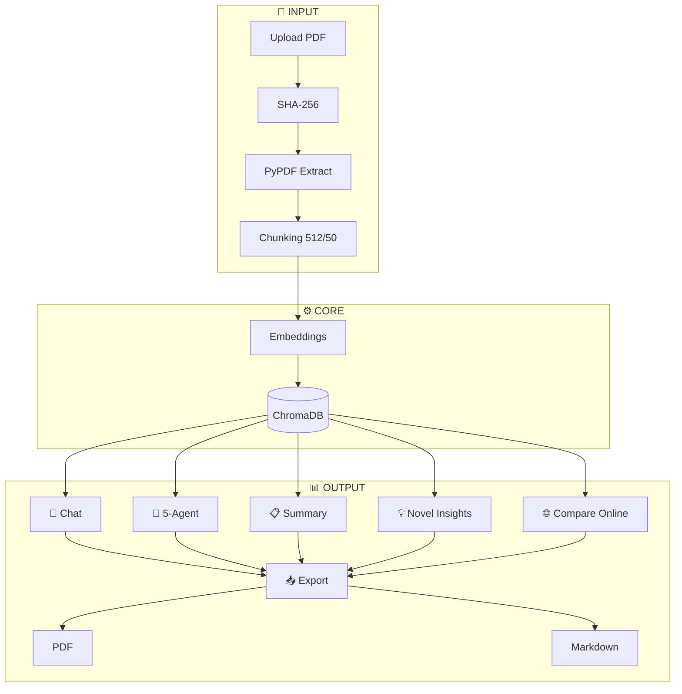

# ScrutinAI — AI Research Gap Finder

[](https://opensource.org/licenses/MIT)
[](https://www.python.org/downloads/)
[](https://fastapi.tiangolo.com)
[](https://groq.com)
[](https://www.trychroma.com)
[](https://render.com)

> **Bridge the known, discover the unknown.**  
> ScrutinAI is an AI-powered academic research assistant and multi-agent scientific discovery platform. Upload any research paper (PDF) to instantly discover unexplored research gaps, detect hidden assumptions, chat with exact source citations, compare with online literature, and run an autonomous 5-agent scientific debate that formulates new breakthrough hypotheses.

---

## 🌟 Key Features

| Feature | Description |
| :--- | :--- |
| 🤖 **5-Agent Autonomous Discovery** | A virtual scientific lab where 5 AI agents (**Concept Mapper**, **Idea Theorist**, **Peer Referee**, **Self-Correction Lead**, and **Blueprint Architect**) debate, challenge, and refine new breakthrough hypotheses beyond the original paper. |
| 🔍 **Academic Critique & Gap Finding** | Automatically extracts **explicit limitations** (with author quotes and page numbers), **inferred methodological flaws**, **prioritized research gaps** (High/Med/Low), and **actionable improvements**. |
| 🎓 **Plain-English Summary** | Translates dense academic jargon into clear, simple language with problem breakdowns and real-world takeaways for students and non-experts. |
| 💡 **'New to the World' Discoveries** | Discovers paradigm shifts, cross-domain transfers (e.g. biology to AI), structural flaws, and unexplored technical combinations across any scientific domain. |
| 🌐 **Live Literature Comparison** | Searches scholarly repositories (**arXiv, PubMed, IEEE, Semantic Scholar**) with strict noise filters to show what external literature covers that the uploaded paper missed. |
| 💬 **Grounded RAG Chat** | Ask any question about your papers. Answers are retrieved via **Hybrid Search (Vector + BM25)** with exact quote snippets, chunk IDs, and page numbers. |

---

## 🏗️ Architecture & Workflow



---
    
## 🔍 How the App Works (Simple Explanation)

 **1. Upload Your Paper**
- Start by uploading any research paper in PDF format. The app reads the entire paper and splits it into small, meaningful chunks. Each chunk is - converted into a mathematical representation (called a vector) so the system can understand and search through the content intelligently.

**2. Ask Questions & Get Answers**
- You can ask any question about the paper, like:

- "What are the limitations of this research?"

- "What methodology was used?"

- "What are the research gaps?"

- The app searches through the paper, finds the most relevant sections, and gives you an answer with:

- Confidence Score: Shows how confident the answer is (High/Medium/Low)

- Page Citations: Exactly which page the information came from

- Source Text: The actual quote from the paper

**3. Discover Research Gaps & Limitations**
- The app automatically finds:

- Explicit Limitations – What the authors themselves admit (with direct quotes and page numbers)

- Inferred Limitations – What the system logically deduces from the methodology, dataset, or experiments

- Research Gaps – What's missing from the paper, categorized as High/Medium/Low priority

- Actionable Improvements – Specific suggestions on what to change and why

**4. 5-Agent Discovery (The AI Scientist Team)**
- This is where the magic happens. The app creates a virtual team of 5 AI agents that work together:

- Agent	Role
- Concept Mapper	Reads the paper and extracts core concepts and ideas
- Idea Theorist	Generates a completely new breakthrough idea
- Peer Referee	Challenges the idea, finds flaws and edge cases
- Self-Correction Lead	Fixes the flaws and strengthens the idea
- Blueprint Lead	Creates a step-by-step testing roadmap
- The result? A completely new discovery that is NOT mentioned anywhere in the original paper!

**5. Live Literature Comparison**
- The app searches online (arXiv, PubMed, IEEE, Semantic Scholar) for similar research papers. It shows you:

- What similar papers exist

- What they cover that your paper doesn't

- How your paper compares to the broader research landscape

**6. Export Reports**
- Once you're done analyzing, you can download everything as:

- PDF Report – A complete, well-formatted document

- Markdown Report – For editing or sharing on platforms like GitHub

**7. Plain-English Summary**
- If you're not a subject matter expert, the app can translate the entire analysis into simple, easy-to-understand language. Perfect for students, non-experts, or anyone who wants a quick overview.

**8. 'New to the World' Discoveries**
- The system goes beyond what's in the paper and finds:

- Paradigm Shifts – Completely new ways to approach the problem

- Cross-Domain Connections – Applying ideas from one field to another

- Hidden Flaws – Things the authors might have missed

- Unexplored Combinations – Ideas that have never been combined before

### 🚀 Quick Start (Local Setup)
1. Clone the Repository
bash
git clone https://github.com/Akash-Sare03/AI_Research_Gap_Finder.git
cd AI_Research_Gap_Finder
2. Create Virtual Environment & Install Dependencies
```
# Windows
python -m venv venv
.\venv\Scripts\Activate.ps1

# macOS / Linux
python3 -m venv venv
source venv/bin/activate

# Install requirements
pip install -r requirements.txt
3. Configure API Key
Create a .env file from the example:

cp .env.example .env     # On Windows: copy .env.example .env
Add your free Groq API Key:

env
GROQ_API_KEY=gsk_your_groq_api_key_here
LLM_MODEL=qwen/qwen3.8-27b
4. Run the Application

python run_app.py
Open your browser at:
```

💻 Web App: http://localhost:8000

📖 Interactive API Docs: http://localhost:8000/docs

## 🛠️ Tech Stack
Backend: FastAPI, Uvicorn, LangChain, LangGraph, Pydantic

Inference & AI: Groq API (qwen/qwen3.8-27b, openai/gpt-oss-120b)

Embeddings & Search: HuggingFace sentence-transformers/all-MiniLM-L6-v2, ChromaDB, BM25Okapi

PDF & Export: PyPDF, ReportLab (with clean typography sanitization)

Frontend: Vanilla HTML5, Modern CSS3 Glassmorphism, FontAwesome 6, Lucide Icons (zero build step)

## 📜 License
Distributed under the MIT License. Free for academic, personal, and commercial use.